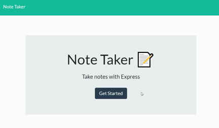

# Note Taker

## Description

A simple way to record thoughts and notes

## Table of Contents

- [Installation](#installation)
- [Application](#application)
- [Usage](#usage)
- [License](#license)
- [Contributing](#contributing)
- [Tests](#tests)
- [Questions](#questions)

## Application

View application here: https://note-taker-kcushing.herokuapp.com/

## Installation

This app is deployed on heroku at the link provided above.

## Usage

Go to the notes page, record a title and content of your note, click save. Your note will appear on the side and you can delete it when you no longer need it.

## License

This project is licensed with MIT

## Contributing

Contact me at the information provided below.

## Tests

No tests have been made thus far.

## Questions

https://github.com/kcushing1

If you have any additional questions, please send an email to kasey.cushing@gmail.com
